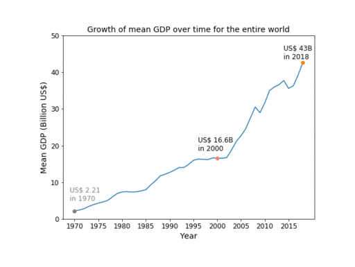

# Investigation of Correlations between Gross Development Product (GDP) with Mortality and Life Expectancy 
We have examined global mortality and life expectancy data and global economic data to look for correlations among mortality rates, GDP, and life expectancy by country and by region.

## Motivation and Hypotheses
1. We expect that life expectancy is positively correlated with GDP.
H0 =  There is no relationship between life expectancy and GDP.
2. We expect that mortality rate is inversely related to GDP, i.e., countries with higher GDPs will tend to have lower mortality rates.
H0 There is no relationship between mortality rates and GDP
### Prerequisites
You should have the following python packages installed in your Python environment to run the included jupyter notebooks:-
```
pandas
requests
json
numpy
matplotlib
os
gmaps
scipy
seaborn
```
You will also require a Google Maps API key which can be replaced in ```config_template.py```. The file then should be renamed to ```config.py``` to work with the existing code.
## Data Sources
The data used in this investigation is included as ```.csv``` files in _Resources_ folder. The data was acquired from the following sources:-
1. **WHO**. World Health Organization Global Health Observatory data repository. "Adult mortality data by country." Retrieved fromhttp://apps.who.int/gho/data/view.main.1360?lang=en¶. Last updated 2018-05-07. Features 17 years' of mortality data from 183 countries
2. **Google** public data repository. [Centroid data by country.] Downloaded from https://developers.google.com/public-data/docs/canonical/countries_csv on 26 January 2020
3. **Kaggle**: https://www.kaggle.com/kumarajarshi/life-expectancy-who/version/1
4. **CDC** Centre for Disease Control: CDC WONDER (underlying cause of death; multiple cause of death) https://wonder.cdc.gov/
5. **World Bank**: https://databank.worldbank.org/reports.aspx?source=2&series=NY.GDP.MKTP.KD.ZG&country=

## Findings
1. Overall, GDP of entire world is increasing overtime.
2. Overall, mortality rate stays stable overtime in the previous 17 year period.
3. Generally speaking, life expectancy is increasing over time (we are living longer than ever before.)
4. Africa has the highest mortality rate
5. There are 5 leading causes of deaths for 25-34 year old Men/Women in USA, among which Use of narcotics rose consistently from 2000 - 2017

## Un-answered Questions:
1. Correlation of specific diseases to countries.
2. Further investigation into leading causes of deaths in USA for 25-34 year old age-groups.
3. Breakdown of causes of deaths in the USA by States
